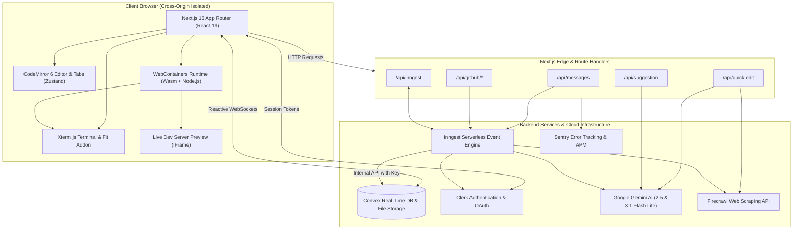

# Prism

A browser-native cloud IDE and full-stack web development platform. Write, preview, and run Node.js applications entirely inside the browser with zero local environment setup or terminal installation.

[](https://github.com/aditya-gupta-me/Prism/actions/workflows/ci.yml)


---

## Table of Contents

- [Overview](#overview)
- [Key Features](#key-features)
- [Architecture & System Design](#architecture--system-design)
  - [High-Level Architecture](#high-level-architecture)
  - [Data Flow & Execution Loop](#data-flow--execution-loop)
  - [Authentication & Internal Security Model](#authentication--internal-security-model)
  - [Browser Isolation & WebContainers](#browser-isolation--webcontainers)
- [Tech Stack](#tech-stack)
- [Project Structure](#project-structure)
- [Getting Started](#getting-started)
  - [Prerequisites](#prerequisites)
  - [Installation](#installation)
  - [Environment Variables](#environment-variables)
  - [Running Locally](#running-locally)
- [Continuous Integration & Quality Checks](#continuous-integration--quality-checks)
- [Deployment](#deployment)
- [Engineering Highlights & Architectural Decisions](#engineering-highlights--architectural-decisions)
- [License](#license)

---

## Overview

Prism solves the friction of local software development by moving the entire development lifecycle into the browser. It unifies a multi-tab code editor, an in-browser Node.js runtime, an AI coding assistant, live dev server preview, and persistent cloud storage into a single cohesive application.

Unlike traditional cloud IDEs that rely on expensive remote virtual machines for every open tab, Prism executes dev servers and Node.js toolchains directly inside the client's browser using WebAssembly and the WebContainers API. Project files are stored reactively in Convex, synchronized live to the in-browser filesystem without container restarts, and backed up via bi-directional GitHub integration.

---

## Key Features

### 1. Code Editor
- **CodeMirror 6 Core:** Syntax highlighting for TypeScript, JavaScript, HTML, CSS, JSON, Markdown, and Python.
- **Tab Lifecycle Management:** Active tab tracking, tab pinning, single-click preview tabs (italicized), double-click to pin, and close actions powered by Zustand.
- **Developer Navigation:** Hierarchical breadcrumb bar, visual indentation guides, CodeMirror minimap, and One Dark theme.
- **Hierarchical File Tree:** Full CRUD operations for nested folders and files, with binary file detection and rendering.

### 2. In-Browser Runtime & Terminal
- **WebContainers Node.js Runtime:** Runs authentic Node.js runtimes, package managers (`npm`, `pnpm`), and development servers directly inside the browser using WebAssembly.
- **Integrated Xterm.js Terminal:** Interactive terminal supporting ANSI color formatting, command execution, and live streaming build/server logs.
- **Zero-Restart Hot Reloading:** Changes saved to Convex are written directly into the WebContainer virtual filesystem via `container.fs.writeFile`, enabling Instant Vite/Next.js HMR without restarting the dev server process.
- **Configurable Runtime Commands:** Per-project configurable `installCommand` and `devCommand`.

### 3. AI-Powered Development Assistance
- **Inline Cursor Completions (`/api/suggestion`):** Context-aware, single-line and multi-line code completions powered by Google Gemini 2.5 Flash Lite.
- **Quick Edit (`Cmd/Ctrl + K` / `/api/quick-edit`):** In-place code refactoring. Accepts plain-English instructions with automatic Firecrawl web scraping when external documentation URLs are provided.
- **Autonomous Multi-Tool Agent (`/api/messages`):** Multi-step coding agent orchestrated via `@inngest/agent-kit` and Gemini 3.1 Flash Lite. The agent inspects files, creates/updates/deletes project code, and fetches external docs autonomously.

### 4. GitHub Synchronization
- **Repository Import:** Imports public or private GitHub repositories by URL with automatic recursive tree resolution, binary file filtering, and Convex persistence.
- **Repository Export:** Asynchronously exports any workspace project to a new public or private GitHub repository under the authenticated user's account.
- **Resilient Background Execution:** Import and export pipelines run as cancelable, multi-step Inngest background jobs.

---

## Architecture & System Design

### High-Level Architecture



### Data Flow & Execution Loop

1. **Workspace Initialization:** When a user opens `/projects/[projectId]`, the application establishes a reactive WebSocket connection to Convex to subscribe to project metadata and hierarchical file trees.
2. **Runtime Boot:** The WebContainer singleton initializes in the client browser, constructs the virtual filesystem in memory via `buildFileTree()`, installs dependencies, and launches the configured dev server.
3. **Reactive Synchronization:** When files are edited locally or modified by the AI agent in Convex, the client's `useWebContainer` hook detects the update and writes the delta directly into the WebContainer filesystem, triggering live HMR.
4. **AI Agent Dispatch:** User messages submitted to `/api/messages` emit a `message/sent` event to Inngest. Inngest executes the agent loop, calling tool functions (`read_files`, `create_files`, `update_file`, `delete_files`, `rename_file`, `scrape_urls`) against Convex internal mutations until task completion.

### Authentication & Internal Security Model

- **User Authentication:** Handled via Clerk with JWT verification. Middleware (`proxy.ts`) protects `/projects/*` routes and API endpoints while allowing public access to marketing, authentication, and SEO metadata routes.
- **Internal System Authentication:** Background workers running on Inngest interact with privileged Convex backend functions defined in `convex/system.ts`. Every internal endpoint enforces authentication against `PRISM_CONVEX_INTERNAL_KEY`.

### Browser Isolation & WebContainers

WebContainers require `SharedArrayBuffer` support, which modern browsers restrict to cross-origin isolated environments. `next.config.ts` enforces these security headers on all responses:
- `Cross-Origin-Embedder-Policy: credentialless`
- `Cross-Origin-Opener-Policy: same-origin`

---

## Tech Stack

| Layer | Technology | Purpose |
| :--- | :--- | :--- |
| **Framework** | Next.js 16.1.1 (App Router) | Server components, route handlers, metadata, Turbopack |
| **UI Library** | React 19.2.3 | Component model and concurrent rendering |
| **Language** | TypeScript 5 | End-to-end static typing |
| **Styling** | Tailwind CSS v4, Radix UI, Shadcn UI | Design tokens, accessible UI primitives, dark mode styling |
| **State Management** | Zustand 5 | Multi-tab editor state, active file tracking |
| **Code Editor** | CodeMirror 6 | Modular syntax highlighting, gutters, indentation markers, minimap |
| **Terminal** | Xterm.js 6 & Fit Addon | In-browser terminal emulator |
| **In-Browser Runtime** | WebContainers API 1.6.1 | WebAssembly-based Node.js runtime environment |
| **Backend & DB** | Convex 1.31.2 | Real-time reactive document database and file storage |
| **Authentication** | Clerk 6.36.5 | User authentication, sessions, and GitHub OAuth token access |
| **Workflow Engine** | Inngest 3.54.0 (LTS) | Serverless background jobs, agent orchestration, GitHub sync |
| **Agent Framework** | `@inngest/agent-kit` 0.13.2 | Multi-tool autonomous agent loop |
| **AI Models** | Google Gemini (2.5 & 3.1 Flash Lite) | Inline suggestions, quick edits, autonomous coding agent |
| **Web Scraping** | Firecrawl 4.10.0 | Markdown documentation extraction for AI context |
| **Observability** | Sentry 10.55.0 | Error monitoring, performance tracing, source map uploads |
| **Continuous Integration** | GitHub Actions | Automated typechecking, linting, and production build checks |
| **Hosting & CD** | Vercel | Production serverless hosting and continuous deployment |

---

## Project Structure

```
prism/
├── .github/
│   └── workflows/
│       └── ci.yml                    # GitHub Actions CI workflow (typecheck, lint, build)
├── app/                              # Next.js App Router pages, layouts, and API routes
│   ├── api/
│   │   ├── github/                   # GitHub repository import and export endpoints
│   │   ├── inngest/                  # Inngest webhook route handler (maxDuration: 60s)
│   │   ├── messages/                 # AI chat message processing and cancellation
│   │   ├── quick-edit/               # In-place code rewrite with doc scraping
│   │   └── suggestion/               # Cursor inline code completion
│   ├── projects/[projectId]/         # IDE workspace layout and editor view
│   ├── sign-in/                      # Clerk sign-in route with noindex metadata
│   ├── sign-up/                      # Clerk sign-up route with noindex metadata
│   ├── layout.tsx                    # Root layout, fonts, global metadataBase, and icons
│   ├── opengraph-image.tsx           # Dynamic 1200x630 branded Open Graph card generator
│   ├── page.tsx                      # Root route (LandingView for visitors, ProjectsView for users)
│   ├── robots.ts                     # Dynamic robots.txt with crawling rules
│   └── sitemap.ts                    # Dynamic sitemap.xml with canonical URLs
├── components/                       # Shared UI components and global providers
│   ├── ai-elements/                  # Streaming AI response renderers (diffs, plans, queues)
│   ├── ui/                           # Radix/Shadcn UI component primitives
│   ├── providers.tsx                 # Context provider wrapper (Clerk, Convex, Theme)
│   └── theme-provider.tsx            # Next-themes dark/light provider
├── convex/                           # Convex database schema, queries, and mutations
│   ├── auth.config.ts                # Clerk JWT auth configuration
│   ├── conversations.ts              # Chat message persistence and streaming state
│   ├── files.ts                      # File CRUD, folder tree queries, and binary storage
│   ├── projects.ts                   # Project management, rename, delete mutations
│   ├── schema.ts                     # Database schema definitions and indexes
│   └── system.ts                     # Privileged internal APIs protected by internal key
├── features/                         # Feature-driven modules
│   ├── auth/                         # Authentication views and loading placeholders
│   ├── conversations/                # AI assistant sidebar, tool definitions, agent router
│   ├── editor/                       # CodeMirror configuration, extensions, tab state
│   ├── home/                         # Unauthenticated landing page and root view router
│   ├── preview/                      # WebContainer singleton lifecycle, terminal, file tree utils
│   └── projects/                     # Projects dashboard, command palette, GitHub dialogs
├── lib/
│   ├── convex-client.ts              # Lazy ConvexHttpClient proxy for build safety
│   ├── firecrawl.ts                  # Lazy Firecrawl client factory
│   ├── site-url.ts                   # Canonical URL resolution utility
│   └── utils.ts                      # Tailwind CSS class merging utilities
├── public/                           # Static assets, branding logos, and favicon
├── next.config.ts                    # Security headers (COOP/COEP) and Sentry configuration
├── package.json                      # Project dependencies, scripts, and patch-package hook
└── proxy.ts                          # Clerk authentication middleware routing
```

---

## Getting Started

### Prerequisites

- **Node.js:** v20.0.0 or higher
- **Package Manager:** npm v10+ or pnpm
- **Accounts:**
  - [Convex](https://www.convex.dev/) account and project
  - [Clerk](https://clerk.com/) account for user authentication
  - [Google AI Studio](https://aistudio.google.com/) for Gemini API access
  - [Firecrawl](https://www.firecrawl.dev/) API key *(optional, for URL doc scraping)*
  - [Inngest](https://www.inngest.com/) account or local Inngest Dev Server

### Installation

1. **Clone the repository:**
   ```bash
   git clone https://github.com/aditya-gupta-me/Prism.git
   cd Prism
   ```

2. **Install dependencies:**
   ```bash
   npm install
   ```
   *(The `postinstall` script automatically applies required patches via `patch-package`)*

3. **Initialize and start the Convex backend:**
   ```bash
   npx convex dev
   ```
   This generates the type-safe client interfaces in `convex/_generated` and starts the local Convex sync engine.

### Environment Variables

Create a `.env.local` file in the project root:

```env
# Clerk Authentication
NEXT_PUBLIC_CLERK_PUBLISHABLE_KEY=pk_test_...
CLERK_SECRET_KEY=sk_test_...
CLERK_JWT_ISSUER_DOMAIN=https://<your-clerk-domain>.clerk.accounts.dev

# Convex Backend
CONVEX_DEPLOYMENT=dev:<your-convex-deployment>
NEXT_PUBLIC_CONVEX_URL=https://<your-convex-deployment>.convex.cloud

# Internal Security (Shared between Inngest workers and Convex internal mutations)
PRISM_CONVEX_INTERNAL_KEY=your_secure_random_internal_key

# Google AI (Gemini Models)
GOOGLE_GENERATIVE_AI_API_KEY=your_gemini_api_key
GEMINI_API_KEY=your_gemini_api_key

# Firecrawl (Optional - for URL scraping in Quick Edit and AI Agent)
FIRECRAWL_API_KEY=fc-...

# Inngest (Production / Cloud)
INNGEST_EVENT_KEY=your_inngest_event_key
INNGEST_SIGNING_KEY=your_inngest_signing_key

# Sentry (Optional - for source maps and error tracking)
SENTRY_AUTH_TOKEN=sntrys_...

# Canonical Site URL (Optional in production, defaults to VERCEL_URL / localhost)
NEXT_PUBLIC_APP_URL=https://your-domain.com
```

### Running Locally

1. **Start the Inngest local dev server** (in a separate terminal):
   ```bash
   npx inngest-cli@latest dev
   ```

2. **Start the Next.js development server:**
   ```bash
   npm run dev
   ```

3. Open [http://localhost:3000](http://localhost:3000) in your browser.

---

## Continuous Integration & Quality Checks

Prism uses **GitHub Actions** for Continuous Integration. Every Pull Request and push to `master` triggers automated quality checks in `.github/workflows/ci.yml`:

```bash
# Type check TypeScript codebase
npm run typecheck

# Lint with ESLint
npm run lint

# Compile and verify Next.js production build
npm run build
```

### CI vs CD Separation
- **CI (GitHub Actions):** Validates code quality, static type safety, linting rules, and production build compilation on Ubuntu runners.
- **CD (Vercel):** Automatically deploys the production application and manages serverless edge functions upon successful merges into `master`.

---

## Deployment

The application is deployed on **Vercel** with full serverless edge routing.

### Production Deployment Steps
1. Import the repository into your Vercel account.
2. Ensure all required environment variables listed above are configured under **Project Settings → Environment Variables**.
3. Install the **Inngest Vercel Integration** to automatically provision `INNGEST_EVENT_KEY` and `INNGEST_SIGNING_KEY`.
4. Deploy the application. The default `/api/inngest` route handler will automatically sync with Inngest Cloud.

---

## Engineering Highlights & Architectural Decisions

- **Client-Side WebContainers Execution:** Rather than running compute-heavy container clusters on the backend, Prism executes Node.js environments directly in the user's browser using WebAssembly. This achieves zero infrastructure container cost and sub-second boot times.
- **Reactive Convex Filesystem:** Project files are organized in a single flat database table using recursive `parentId` pointers. The in-memory tree is constructed on demand via `buildFileTree()`, allowing reactive subscriptions to update individual files without full tree refetches.
- **Direct Filesystem Sync (Zero-Restart HMR):** The `useWebContainer` hook watches Convex query updates and injects changed code directly into the WebContainer virtual disk via `container.fs.writeFile`, enabling Vite/Next.js HMR to trigger without restarting the server process.
- **Lazy HTTP Client Initialization with Proxies:** To prevent Next.js from crashing during static route analysis and build-time page data collection when database URLs are evaluated, `lib/convex-client.ts` uses a JavaScript `Proxy` pattern to lazily instantiate `ConvexHttpClient` only when queries or mutations execute at runtime.
- **Dual-Layer Security Perimeter:** Client-initiated operations are authenticated via Clerk JWT tokens. Long-running Inngest background operations execute via internal Convex mutations verified by a dedicated `PRISM_CONVEX_INTERNAL_KEY`.
- **Dynamic SEO & Metadata Engine:** Implemented Next.js App Router metadata conventions including server-rendered `app/opengraph-image.tsx`, automated `app/robots.ts`, `app/sitemap.ts`, and structured `WebApplication` JSON-LD schema with `noindex` guards on private workspaces.

---

## License

This project is open source and available under the [MIT License](LICENSE).